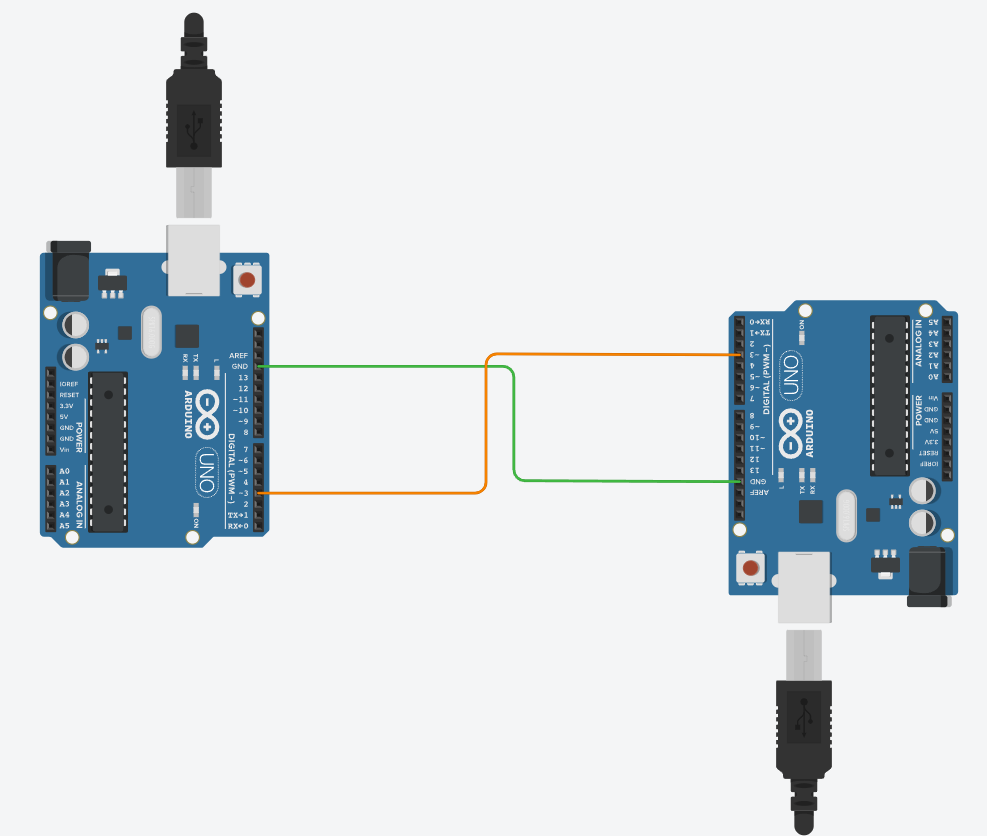
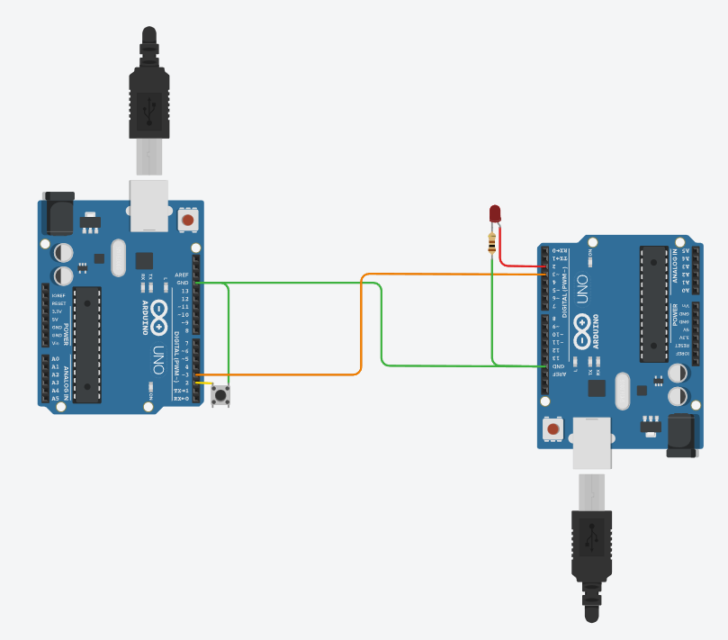

# Lihtsate signaalide saatmine kahe Arduino vahel

Kõige lihtsamal juhul on saadetavad signaalid binaarsed - näiteks nupuvajutus. Nupp on, kas alla vajutatud, või ei ole seda. Sellise informatsiooni edastamine ühelt arduinolt teisele on korraldatav ühendades omavahel arendusplaatide digitaalviigud ja maandusviigud (GND).

*Ühendus lihtsa binaarse signaali edastamiseks*

GND-viikude ühendamine kahe Arduino vahel on hädavajalik, sest see loob ühise viitepinge (ingl *reference voltage*) mõlema seadme vahelise signaaliedastuse jaoks. Kui üks Arduino saadab digitaalsignaali (nt HIGH = 5V), siis see pinge on määratletud tema enda GND suhtes. Kui teine Arduino loeb seda signaali, aga nende GND-viigud pole omavahel ühendatud, ei tea vastuvõtja, mille suhtes see pinge on – tema 5V võib olla saatja 3V või 7V suhtes, sõltuvalt sellest, kuidas süsteemid toidetud on.

Sellise ühenduse puhul saadab üks Arduino digitaalviigust kõrge või madala signaali, mida teine Arduino loeb kas loogilise kõrge (HIGH) või madala (LOW) väärtusena. Näiteks kui saatja Arduino tuvastab nupuvajutuse, seab ta oma väljundviigu kõrgeks. Vastuvõtja loeb sama viigu sisendina ja reageerib vastavalt – näiteks süütab LED-i või alustab mõnda toimingut. See lahendus on sobilik lihtsate, kiirete ja väikese mahuga signaalide edastamiseks, kuid piiratud paindlikkusega, kuna iga täiendav signaalinupp vajab eraldi juhtmeühendust.

~~~cpp
// SAATJA
void setup()
{
  pinMode(2, INPUT_PULLUP); //nupu lugemise viik
  pinMode(3, OUTPUT); //ühendusviik vastuvõtjaga
}

void loop()
{
  if(digitalRead(2) == LOW){ //kui nupp on alla vajutatud
  	digitalWrite(3, HIGH); //ühendusviigule vastuvõtjaga signaal HIGH (5V)
  }else{  //kui nupp ei ole alla vajutatud
   	digitalWrite(3, LOW); //Ühendusviigule vastuvõtjaga signaal LOW (0V)
  }
}
~~~
~~~cpp
//VASTUVÕTJA
void setup()
{
  pinMode(2, OUTPUT); //LED-i juhtimise viik
  pinMode(3, INPUT); //ühendusviik saatjaga
}

void loop()
{
  if(digitalRead(3)==HIGH){ //Kui ühendusviigul saatjaga on signaal HIGH (5V)
  	digitalWrite(2, HIGH); //LED-i juhtviigule pinge 5V (LED põleb)
  }else{ //Kui ühendusviigul saatjaga on signaal LOW (0V)
    digitalWrite(2, LOW); //LED-i juhtviigule ping 0V (LED ei põle)
  }
}
~~~

[Interaktiivne simulatsioon](https://www.tinkercad.com/things/iG2t2hk4u0Y-lihtne-signaaliedastus?sharecode=L7F71YvCVGFMR-UxZC6i8J2CFhUY9LUxnySc3Jy4tp4)