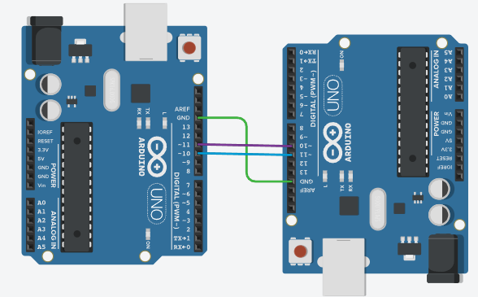

# Keerukamate signaalide saatmine kahe Arduino vahel

- [Andmete edastamine üle jadaliides](#andmete-edastamine-üle-jadaliides)
  - [Näide Stringi saatmisest](#näide-stringi-saatmisest)
  - [JSON andmevahetusvormingu kasutamine](#json-andmevahetusvormingu-kasutamine)
- [Andmete edastamine üle WiFi](#andmete-edastamine-üle-wifi)
  - [Kliendi kood](#Kliendi-kood)
  - [Serveri kood](#Serveri-kood)

Eelmises näites vaatasime, kuidas saame kahte Arduinot omavahel kahe juhtmega ühendades saata lihtsat binaarset signaali. Kui meil on vaja saata aga keerukamaid andmeid, siis selline lähenemine ei sobi.
Järgnevalt vaatame keerukamate andmete saatmist kahel erineval juhul:
* Kaks Arduinot on omavahel ühendatud kahe juhtmega üle mille saadetakse jadaliidese UART (ingl *Universal Asynchronous Receiver-Transmitter*) protokolli abil andmeid. **NB!** nagu eelmises näites nii on ka siin vajalik ühine GND ühendus.
* Arduino UNO R4 on varustatud WiFi liidesega, seega on võimalik andmeid edastada üle WiFi võrgu.

## Andmete edastamine üle jadaliides
Jadaliides (ingl *serial interface*)  on andmeside viis, kus andmeid saadetakse ja võetakse vastu ühe biti kaupa järjestikku mööda ühte või kahte juhet. Seda vastandatakse paralleelliidesele, kus andmeid edastatakse mitme biti kaupa korraga mitmel juhtmel.

Arduino Uno'l on üks riistvaraline jadaliides (tuntud ka kui UART või Serial), mis töötab:

* TX (ingl *transmit*) – viik 1: andmete saatmiseks
* RX (ingl *receive*) – viik 0: andmete vastuvõtmiseks

Need on otse ühendatud USB-Serial muunduriga, mis tähendab, et neid kasutatakse ka siis, kui laed koodi Arduino IDE-st või kasutad Serial Monitori. Seetõttu tuleb neid viike välistes ühendustes kasutada ettevaatusega – kui need on ühendatud teise seadmega, võib see takistada programmi üleslaadimist või segada andmesidet arvutiga.

Seetõttu on mõistlik kasutada SoftwareSerial teeki, mis võimaldab luua täiendavaid jadaliideseid suvalistele digitaalviikudele (näiteks D8 ja D9). See töötab tarkvaraliselt ning on küll veidi aeglasem ja piiratum kui riistvaraline liides, aga väga praktiline.

Software Serial kasutamise korral kahe Arduino ühendamiseks oleks füüsiline ühendusskeem näiteks järgmine:

* Saatja D10 (TX) → Vastuvõtja D11 (RX)
* Saatja D11 (RX) ← Vastuvõtja D10 (TX)
* GND → GND (mõlema Arduino GND-viigud peavad olema ühendatud!)

### Näide Stringi saatmisest

Järgnevas näites saadab üks Arduino teate "Ping" ja kui teine Arduino on selle teate kätte saanud, siis vastab ta "Pong"

~~~cpp
//PING
#include <SoftwareSerial.h>

SoftwareSerial mySerial(10, 11); // RX, TX

void setup() {
  Serial.begin(9600); // Arvutiga suhtlus
  mySerial.begin(2400);  // Teise Arduino'ga suhtlus
}

void loop() {
  mySerial.print("ping"); // Saada sõnum
  Serial.println("Saadetud: ping"); //Kirjuta arvutile mida saatsid

  delay(1000); // Ooteaeg, et teine Arduino jõuaks vastata

  if (mySerial.available()) { //Kui jadaliidesele on tulnud andmeid
    String response = mySerial.readString(); //loe andmed ja eelda, et need on string
    Serial.print("Vastus: "); //Kirjuta arvuti jadaliidese peale välja, mida vastuseks said
    Serial.println(response);
  }

  delay(1000); // Oota enne uut ping'i
}
~~~

~~~cpp
//PONG
#include <SoftwareSerial.h>

SoftwareSerial mySerial(10, 11); // RX, TX

void setup() {
  Serial.begin(9600); // Arvutiga suhtlus
  mySerial.begin(2400); // Teise Arduino'ga suhtlus
}

void loop() {
  if (mySerial.available()) { //Kui jadaliidesele on tulnud andmeid
    String message = mySerial.readString(); //loe andmed ja eelda, et need on string

    Serial.print("Saadi: "); //Kirjuta arvuti jadaliidese peale välja, mida vastuseks saadeti
    Serial.println(message);

    if (message == "ping") { // kui saadeti "ping"
      mySerial.print("pong"); //vasta "pong"
      Serial.println("Saadetud: pong"); //kirjuta arvuti jadaliidesele, mida saatsid
    }
  }
}
~~~

[Interaktiivne simulatsioon](https://www.tinkercad.com/things/aWeu8I6izJ3-ping-pong?sharecode=jb9FeLlcVBtkklh1f_wDyDHqJns84sqinYvRK5oNSmI)

### JSON andmevahetusvormingu kasutamine

JSON (JavaScript Object Notation) on lihtne ja inimloetav andmevahetusvorming, mida kasutatakse laialdaselt struktureeritud andmete edastamiseks rakenduste ja süsteemide vahel. See põhineb võtme-väärtuse paaridel ja andmestruktuuridel, nagu massiivid ja objektid, mis teevad sellest paindliku ja loogilise viisi mitmesuguse andmeinfo struktureerimiseks.

JSON-i abil saab ühe sõnumiga edastada erinevat tüüpi andmeid. See on väga kasulik, kui on tarvis edastada näiteks erinevate andurite väärtusi ühelt Arduinolt teisele. Näiteks võib JSON-i sõnum näha välja selline:

~~~json
{
  "temperatuur": 21.5,
  "niiskus": 60,
  "valgus": true,
  "asukoht": "elutuba"
}
~~~

Näiteks võib sellise JSON sõnumi edastada Arduino, mille küljes on lihtne fototakisti ja DHT22 sensor. Sõnum koostatakse kasutades ArduinoJson.h teeki.

~~~cpp
//SAATJA
#include <SoftwareSerial.h>
#include <DHT.h>
#include <ArduinoJson.h>

DHT dht(2, DHT22); //Andur on DHT22 ja seda loetakse digitaalse viigu 2 kaudu

#define PHOTOPIN A0 // fototakistit loetakse analoog viiguga 0
#define LIGHT_THRESHOLD 500  // piir, millest väiksem = Valgust pole

SoftwareSerial mySerial(10, 11); // RX, TX

void setup() {
  Serial.begin(9600);
  mySerial.begin(9600);
  dht.begin();
}

void loop() {
  float temperatuur = dht.readTemperature(); //loe temperatuur
  float niiskus = dht.readHumidity(); // loe niiskus
  int valgusTooRaw = analogRead(PHOTOPIN); //loe valgustase
  bool onValgus = valgusTooRaw > LIGHT_THRESHOLD; //kui valgustase on suurem kui piir, siis järelikult on valge

  StaticJsonDocument<200> doc; //alustane JSON teate loomist
  doc["temperatuur"] = temperatuur; //lisame võtme ja väärtuse
  doc["niiskus"] = niiskus; //lisame võtme ja väärtuse
  doc["valgus"] = onValgus; //lisame võtme ja väärtuse
  doc["asukoht"] = "elutuba"; //lisame võtme ja väärtuse

  serializeJson(doc, mySerial); //saadame JSON teate üle jadaliidese
  
  //Kirjutame arvuti jadaliidese peale välja, mida saatsime
  Serial.println("JSON saadetud:");
  serializeJsonPretty(doc, Serial);
  Serial.println();

  delay(2000);
}
~~~
~~~cpp
//Vastuvõtja
#include <SoftwareSerial.h>
#include <ArduinoJson.h>

SoftwareSerial mySerial(10, 11); // RX, TX

void setup() {
  Serial.begin(9600);
  mySerial.begin(9600);
  Serial.println("Valmis andmeid vastu võtma...");
}

void loop() {
  if (mySerial.available()) { //kui jadaliidesele on saadetud andmeid
    String jsonString = mySerial.readString();  //loeme neid kui stringi

    StaticJsonDocument<200> doc; //defineerime JSON objekti
    //sisustame JSON objekti jadaliidesele saadetud andmetega
    DeserializationError error = deserializeJson(doc, jsonString);

    if (error) { //juhul kui eelmine operatsioon tagastas veakoodi
      Serial.print("Viga JSONi lugemisel: ");
      Serial.println(error.c_str());
      return;
    }

    // Väljade lugemine ja selgitustega väljatrükk
    float temp = doc["temperatuur"];
    float hum = doc["niiskus"];
    bool light = doc["valgus"];
    const char* room = doc["asukoht"];

    Serial.println("Saabus andmesõnum:");
    Serial.print("  Asukoht: ");
    Serial.println(room);
    Serial.print("  Temperatuur: ");
    Serial.print(temp);
    Serial.println(" °C");
    Serial.print("  Niiskus: ");
    Serial.print(hum);
    Serial.println(" %");
    Serial.print("  Valgust on ruumis: ");
    Serial.println(light ? "Jah" : "Ei");
    Serial.println();
  }
}
~~~

## Andmete edastamine üle WiFi

Arduino UNO R4 WiFi plaadid sisaldavad integreeritud WiFi-ühendust (tänu ESP32-S3 moodulile), mis võimaldab andmeid saata ja vastu võtta üle WiFi-võrgu, kasutades näiteks UDP, TCP või HTTP protokolli.

Allpool on ümber tehtud JSON andmevahetuse näide, kus üks UNO R4 WiFi arendusplaat (anduritega klient) saadab JSON-sõnumi teisele UNO R4 WiFi-le (server) üle WiFi TCP-ühenduse. Kasutame WiFiS3 teeki (osa Arduino R4 standardteekidest).

Käivita esmalt server ja oota, et see annaks oma IP aadressi jadaühenduse kaudu. Kliendi koodis asenda saadud IP aadress.

### Serveri kood
~~~cpp
// SERVER – UNO R4 WiFi
#include <WiFiS3.h>
#include <ArduinoJson.h>

char ssid[] = "SINUVÕRK";
char pass[] = "SINUPAROOL";

const uint16_t PORT = 5000;

WiFiServer server(PORT);

void setup() {
  Serial.begin(9600);
  while (!Serial) {}

  WiFi.begin(ssid, pass);
  Serial.print("Ühendan WiFi-ga");
  while (WiFi.status() != WL_CONNECTED) {
    delay(500); Serial.print(".");
  }
  Serial.println("\nWiFi OK");
  delay(5000); //ootame 5 sekundit, et võrguseadistus DHCP käest kätte saada
  Serial.print("IP: "); Serial.println(WiFi.localIP()); //kui IP on 0.0.0.0 siis ei saadud DHCP käest seadistust

  server.begin();
  Serial.print("TCP server kuulab pordil "); Serial.println(PORT);
}

void loop() {
  WiFiClient client = server.available();
  if (!client) return;

  Serial.println("Klient ühendus.");

  // loe ühe rea kaupa (kliendi saade lõpeb \n-iga)
  String line = client.readStringUntil('\n');

  StaticJsonDocument<200> doc;
  DeserializationError err = deserializeJson(doc, line);
  if (err) {
    Serial.print("JSON viga: "); Serial.println(err.c_str());
  } else {
    float temp = doc["temperatuur"] | NAN;
    float hum  = doc["niiskus"] | NAN;
    bool  light = doc["valgus"] | false;
    const char* room = doc["asukoht"] | "tundmatu";

    Serial.println("Saabus andmesõnum:");
    Serial.print("  Asukoht: "); Serial.println(room);
    Serial.print("  Temperatuur: "); Serial.print(temp); Serial.println(" °C");
    Serial.print("  Niiskus: "); Serial.print(hum);  Serial.println(" %");
    Serial.print("  Valgus: "); Serial.println(light ? "Jah" : "Ei");
    Serial.println();
  }

  client.stop();
}
~~~

### Kliendi kood
~~~cpp
#include <WiFiS3.h>
#include <ArduinoJson.h>
#include <DHT.h>

#define DHTPIN 2
#define DHTTYPE DHT22
#define PHOTOPIN A0
#define LIGHT_THRESHOLD 500

char ssid[] = "SINUVÕRK";
char pass[] = "SINUPAROOL";

// Serveri IP peab kattuma serveri IP-ga, mille said serveri käivitamisel
IPAddress serverIP(10, 167, 75, 167);
const uint16_t serverPort = 5000;

WiFiClient client;
//DHT dht(DHTPIN, DHTTYPE);

void setup() {
  Serial.begin(9600);
  while (!Serial) {}
  dht.begin();

  WiFi.begin(ssid, pass);
  Serial.print("Ühendan WiFi-ga");
  while (WiFi.status() != WL_CONNECTED) {
    delay(500); Serial.print(".");
  }
  Serial.println("\nWiFi OK");
  Serial.print("Kliendi IP: "); Serial.println(WiFi.localIP());
}

void loop() {
  float temperatuur = dht.readTemperature();   // °C
  float niiskus     = dht.readHumidity();
  bool  valgus      = analogRead(PHOTOPIN) > LIGHT_THRESHOLD;

  // kui DHT andur eksib, ära saada prügi
  if (isnan(temperatuur) || isnan(niiskus)) {
    Serial.println("DHT lugemisviga, proovin uuesti...");
    delay(2000);
    return;
  }

  StaticJsonDocument<200> doc;
  doc["temperatuur"] = temperatuur;
  doc["niiskus"]     = niiskus;
  doc["valgus"]      = valgus;
  doc["asukoht"]     = "elutuba";

  if (client.connect(serverIP, serverPort)) {
    serializeJson(doc, client);
    client.println();          // lõpetame reaga, et server saaks readStringUntil('\n')
    client.flush();
    client.stop();

    Serial.println("JSON saadetud:");
    serializeJsonPretty(doc, Serial);
    Serial.println();
  } else {
    Serial.println("Ühendus serveriga ebaõnnestus.");
  }

  delay(2000);
}

~~~
